# Задание 08-ansible-05-testing

## Molecule

1. molecule test -s ubuntu_focal

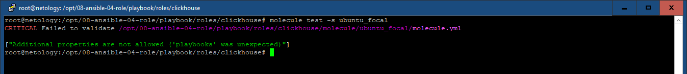

2. molecule init scenario --driver-name docker

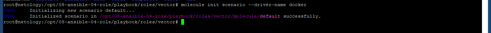

3. molecule test

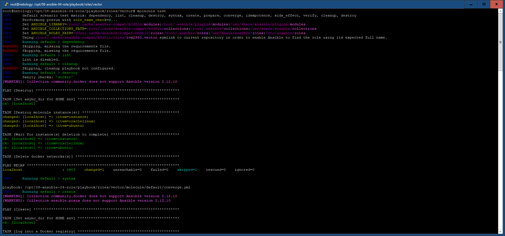
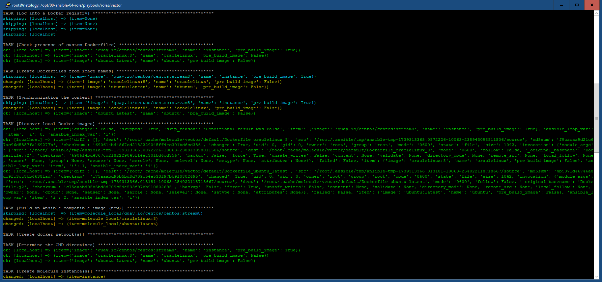
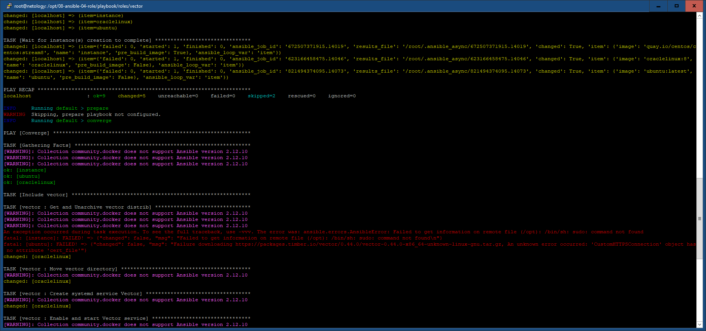
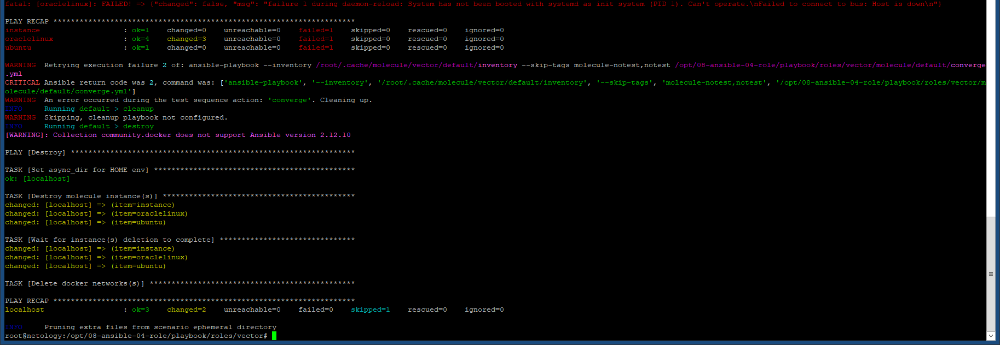

Ошибки:
 - в используемых RedHat-подобных ОС отсутствует sudo
 - в RedHat-подобных ОС ошибки инициализации systemd
Решение:
 - использование существующих пользовательских прав
 - уход от использования сервиса vector, переход на использование tmux

molecule test

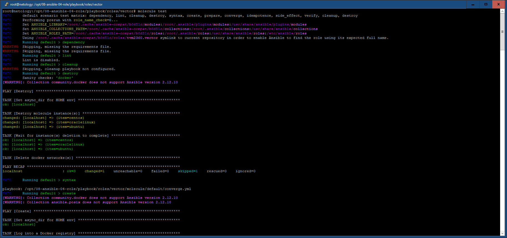
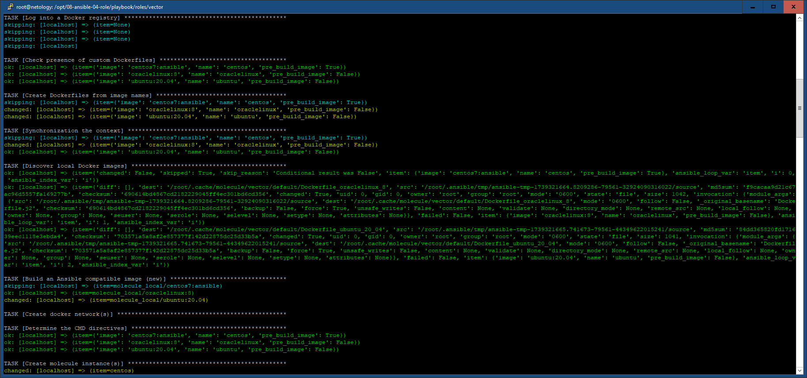
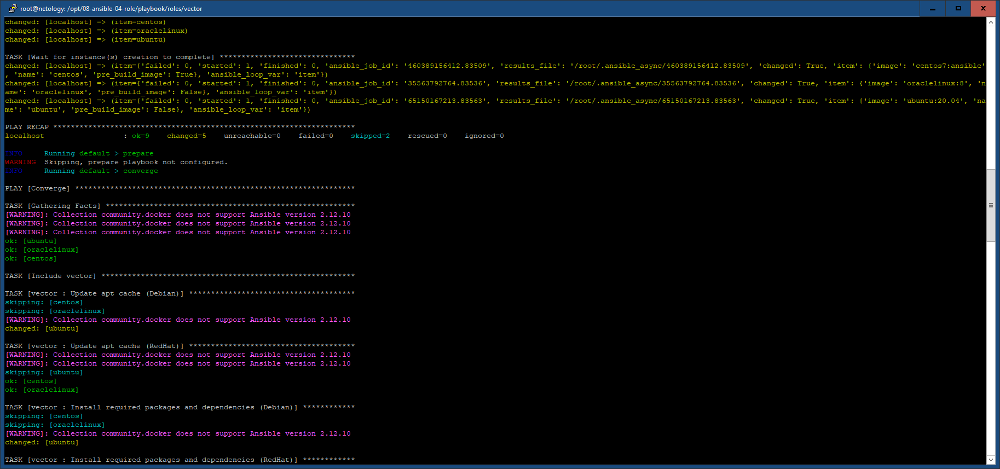
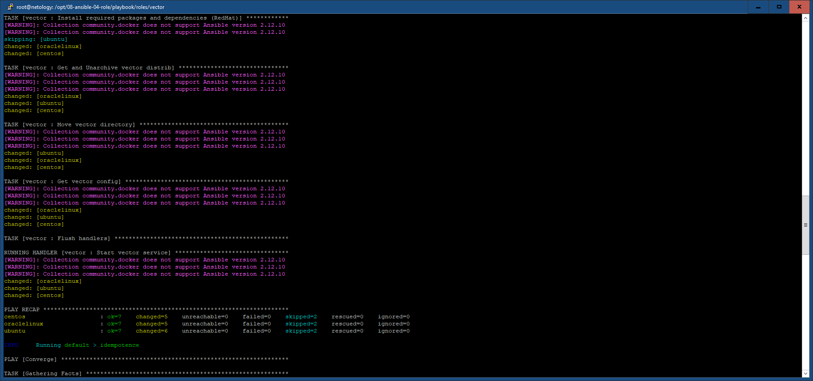
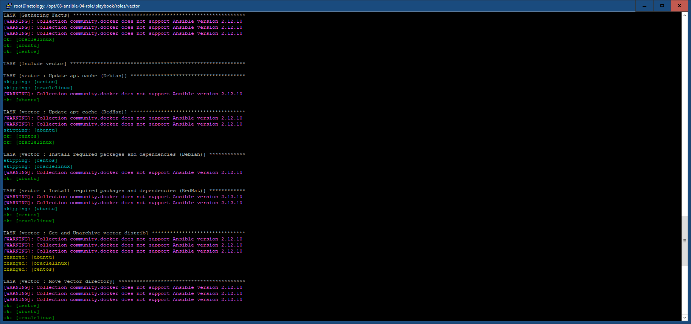
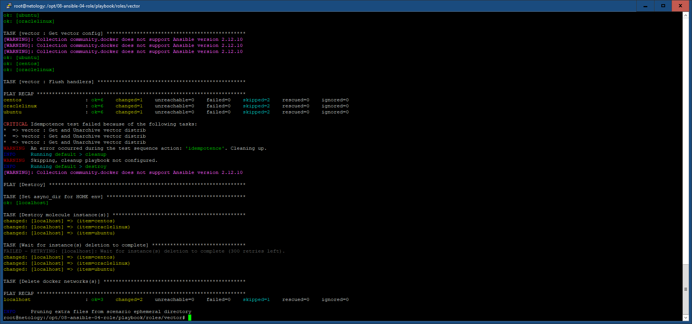

