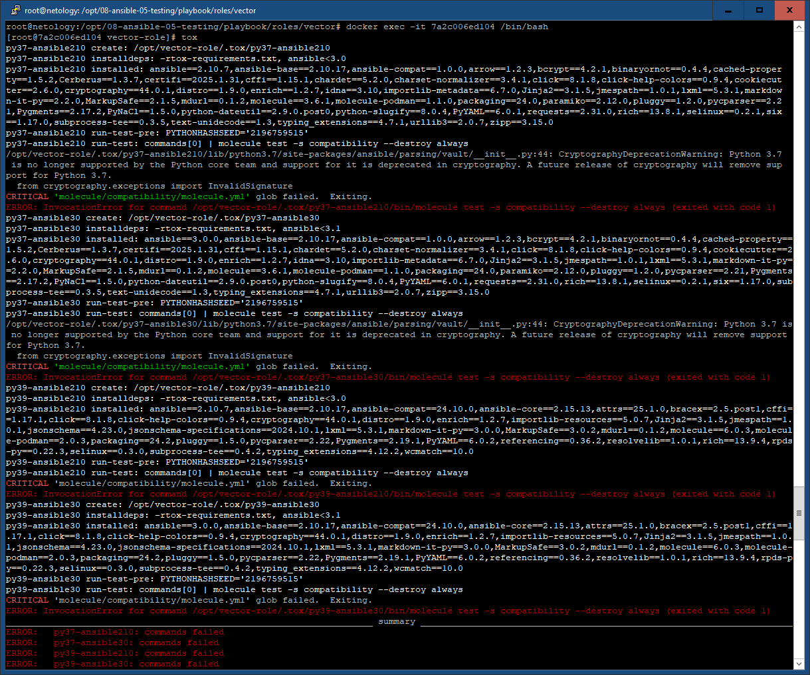

# Задание 08-ansible-05-testing

## Molecule

1. Тест
``` bash
molecule test -s ubuntu_focal
```


2. Добавление сценария
``` bash
molecule init scenario --driver-name docker
```


3. Проверка на ошибки
``` bash
molecule test
```


Ошибки:
 - в используемых RedHat-подобных ОС отсутствует sudo
 - в RedHat-подобных ОС ошибки инициализации systemd

Решение:
 - использование существующих пользовательских прав
 - уход от использования сервиса для vector, переход на использование tmux

``` bash
molecule test
```


4. verify.yml
``` ansible
- name: Verify vector
  hosts: all
  gather_facts: false
  tasks:
  - name: "stat file vector exists"
    stat:
      path: "/opt/vector/bin/vector"
    register: file_vector_stat
  - name: "stat file vector config exists"
    stat:
      path: "/opt/vector/config/vector.yaml"
    register: file_vector_config_stat
  - name: "check if file vector exists"
    assert:
      that:
        - file_vector_stat.stat.exists == True
      success_msg: "vector exists"
      fail_msg: "vector doesn't exist"
  - name: "check if file vector config exists"
    assert:
      that:
        - file_vector_config_stat.stat.exists == True
      success_msg: "vector config exists"
      fail_msg: "vector config doesn't exist"
```

5. Проверка успешна


## Tox

1. tox.ini
``` ansible
[tox]
minversion = 1.8
basepython = python3.6
envlist = py{37,39}-ansible{210,30}
skipsdist = true

[testenv]
passenv = *
deps =
    -r tox-requirements.txt
    ansible210: ansible<3.0
    ansible30: ansible<3.1
commands =
    {posargs:molecule test -s compatibility --destroy always}
```

tox-requirements.txt
``` ansible
selinux
lxml
molecule
molecule_podman
jmespath
```

2.
``` bash
docker run -d --rm --name tox --privileged=True -v /opt/08-ansible-05-testing/playbook/roles/vector:/opt/vector-role -w /opt/vector-role -it aragast/netology:latest /bin/bash
```



